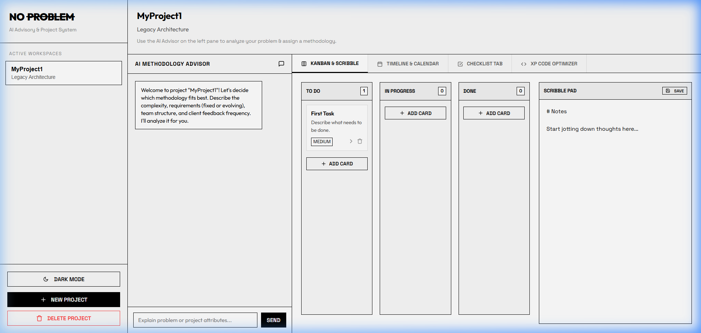

# NO PROBLEM | AI Advisory & Project System

A stark minimalist, high-fidelity Black & White (B&W) project workspace system designed to help teams identify and run the perfect methodology (Scrum, Kanban, XP, Waterfall, or Hybrid). Features a custom animated entrance and a real-time AI Agent Advisor integrated with the Google Gemini API.



## Features

- **Minimalist Aesthetics**: Clean, distraction-free black and white user interface.
- **Enticing Splash Screen**: Fully custom typewriter, strike-through, and slide-in logo animation sequence on initial load.
- **Real-time AI Advisory Agent**:
  - Direct integration with Google Gemini.
  - Fully context-aware: reads project name, description, Kanban tasks, milestone dates, checklist items, and scribble pad notes.
  - Dynamically updates project methodology and suitability analysis parameters via parsed response instructions.
- **Interactive Workspace Tools**:
  - **Kanban Board**: Drag-and-drop or state-select card management.
  - **Milestone Timeline**: Clean visual calendar mapping out key dates.
  - **Checklist Manager**: Add and cross off operational setup items.
  - **Scribble Pad**: Persistent scratch note-taking.
  - **XP Code Optimizer**: Analyzes Javascript for code smells and refactors patterns for clean-code compliance.

## Installation & Setup

1. **Clone the Repository**:
   ```bash
   git clone <your-repository-url>
   cd AGILE
   ```

2. **Install Dependencies**:
   ```bash
   npm install
   ```

3. **Configure the API Key**:
   - Start the app and click the **AI Settings** button in the sidebar footer.
   - Enter your Google Gemini API Key. It is stored securely in your browser's local storage.

4. **Run the Application**:
   - Start the backend server:
     ```bash
     npm run server
     ```
   - Start the Vite frontend development server:
     ```bash
     npm run dev
     ```
   - Open your browser to the local URL (usually `http://localhost:5173`).
